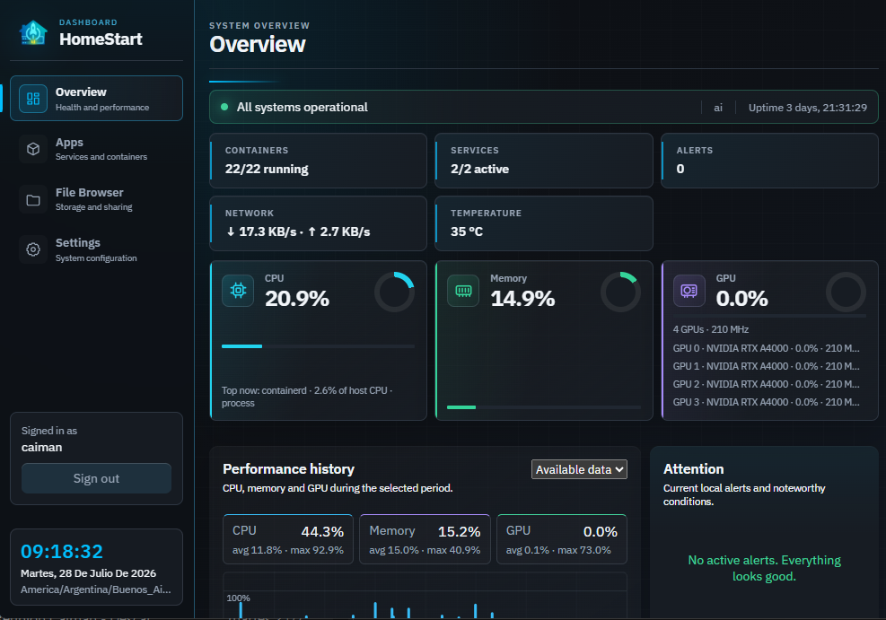
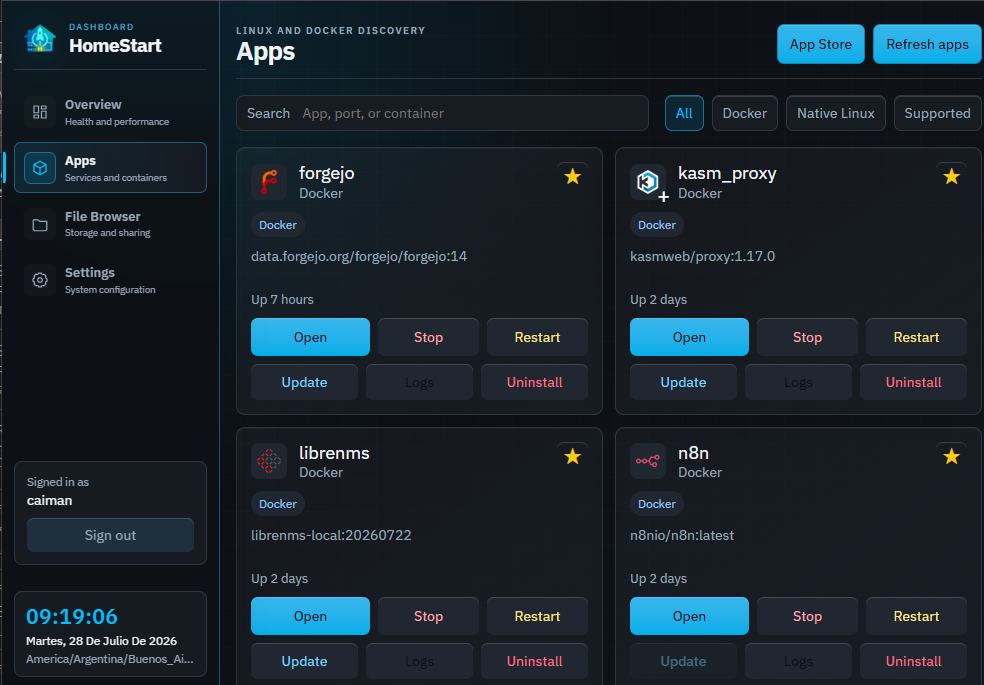
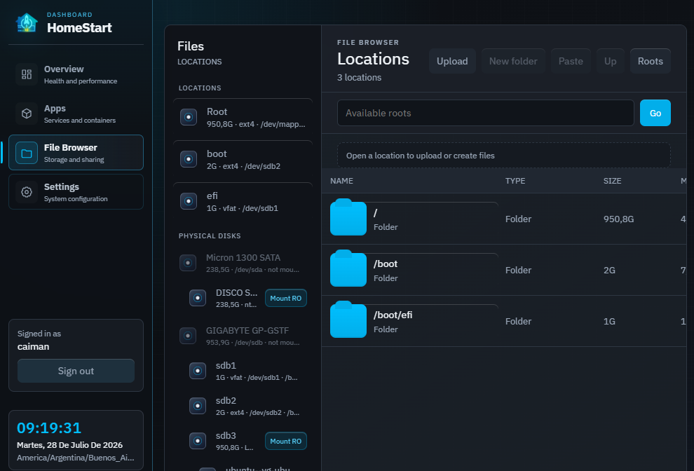
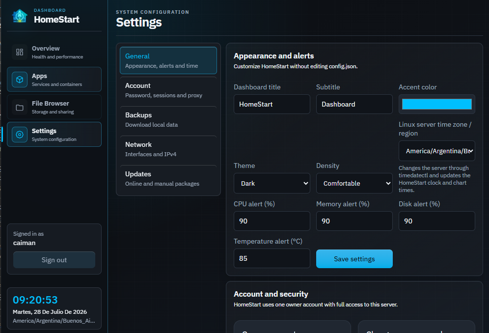

<p align="center">
  
</p>

<p align="center">
  <a href="https://github.com/flotron/homestart/actions/workflows/checks.yml"></a>
</p>

HomeStart is a small self-hosted dashboard for homelabs, local servers, and
small office machines. It is written with the Python standard library plus
PyYAML, and is designed to run as a `systemd` service on a trusted LAN.

It gives you a browser UI to inspect the host, open local apps, manage Docker
containers, browse files, run supported CLI wrappers such as Ookla Speedtest,
and apply local or GitHub release updates without bundling private runtime data.

## Screenshots

| Overview and performance history | Apps and containers |
| --- | --- |
| [](docs/screenshots/overview.png) | [](docs/screenshots/apps.png) |

| File Browser | Settings |
| --- | --- |
| [](docs/screenshots/file-browser.png) | [](docs/screenshots/settings.png) |

## Features

- Professional overview with health state, local alerts, seven days of CPU, memory, and GPU history, physical disks, processes, and Docker resources.
- Apps dashboard: Docker discovery, native/supported app cards, open/stop/restart/uninstall actions.
- Docker support: detects published ports, including stopped containers.
- Managed Docker Compose applications are grouped by project and support
  start, stop, restart, image updates and stack-wide uninstall.
- Compose uninstall can preserve volumes and app data or remove named volumes
  plus HomeStart-managed data. External bind-mounted folders are never deleted.
- Native web discovery: detects Apache/Nginx virtual hosts from enabled config files.
- File Browser: Windows-like navigation, full path address bar, physical disk/USB shortcuts, drag and drop, copy/paste with progress, live speed, ETA and safe cancellation, recursive properties, rename, recoverable trash, downloads, folder ZIPs, new folders, and an optional Samba Share Manager.
- Large copies prefer native GNU `cp` with automatic kernel optimizations and
  transparently fall back to the portable buffered engine when unavailable.
- Permanent server clock: date and time follow the Linux server's configured
  IANA region, editable from Settings.
- Installable web app with HomeStart branding, favicon, Android maskable icons
  and iOS home-screen metadata. Compatible browsers expose an **Install
  HomeStart** action when the dashboard is served in a secure context.
- Interactive history charts: hover or touch to inspect the exact server time
  and CPU, memory, GPU, download and upload values for a sample.
- History snapshots are gzip-compressed and refreshed periodically while the
  two-second live collector advances the network chart locally. Open dashboard
  tabs therefore do not repeatedly transfer the complete seven-day history.
- Per-container network accounting and rankings for the last minute, hour or
  day, with stable container identities, download, upload, total traffic and
  average throughput calculated over the interval actually observed.
- Separate estimated host-traffic rankings use active TCP socket ownership to
  identify native Linux processes and host-network containers, show a visible
  confidence level, and keep unassignable traffic in an Unattributed row.
  HomeStart's own HTTP output is accounted directly and shown separately with
  high confidence.
- Network history uses a percentile-based visual scale so isolated multi-gigabit
  peaks remain inspectable without flattening the latest normal traffic.
- Docker logs and a declarative App Store backed by validated Docker Compose
  templates from the separate
  [HomeStart Apps catalog](https://github.com/flotron/homestart-apps).
- App Store templates show informational warnings for privileged containers,
  host namespaces, Docker socket/device access and sensitive host mounts.
- Configurable theme, accent, density, dashboard labels, and alert thresholds.
- Instantaneous top CPU process/container attribution and optional daily SMART
  disk health alerts through `smartctl`, without waking standby HDDs.
- Manual downloadable backups for configuration, history, and custom icons.
- Custom app icons stored locally under `data/`.
- Settings: network interface configuration through Netplan or NetworkManager,
  GitHub release update checks, and update uploads.
- Runtime architecture awareness for `amd64`, `arm64` and `arm/v7`, with
  declarative App Store compatibility metadata and Docker manifest preflight.
- Supported apps:
  - Ookla Speedtest CLI wrapper with stored local history.
- Safe packaging: installer/update archives exclude local runtime data.

## Security Model

HomeStart requires one local owner account. On the first start it creates a one-time
setup code and prints it in the service journal:

```sh
sudo journalctl -u homestart.service -n 30 --no-pager
```

Enter that code in the browser to create the owner. Passwords must contain
at least six characters; longer passphrases are recommended. Passwords are
stored as salted `scrypt` hashes and web sessions use random opaque tokens
stored server-side. “Remember this device” keeps a session for up to 30 days.

The owner has full dashboard access. This login is an access gate; it does not
replace Linux or Samba identities and does not reduce existing File Browser,
Docker, Samba, network or update functionality. Password and session security
are managed from `Settings > Account`.

Releases 3000 and 3010 briefly allowed additional equal-privilege accounts.
Upgrades preserve those accounts so nobody is locked out. They appear as
legacy accounts and the primary owner may remove them, but HomeStart no longer
creates additional accounts.

Failed sign-ins are progressively throttled by account and client without a
permanent lockout. The delay begins after five failures and expires after a
quiet period.

The built-in login protects access but plain HTTP does not encrypt credentials
or session cookies on the network. HomeStart is still intended for a trusted
LAN. Use HTTPS through a suitable reverse proxy before exposing it across an
untrusted network or the public internet.

## Install as a web app

HomeStart includes a web app manifest, HomeStart launcher icons and a service
worker, so it can open in its own standalone window from a desktop or mobile
home screen. When Chromium exposes its native installation prompt, HomeStart
shows an **Install HomeStart** button in the sidebar. On iPhone and iPad, use
Safari's **Share > Add to Home Screen** action.

Browsers require a secure context for service workers and full PWA
installation. This means HTTPS (normally supplied by a trusted reverse proxy)
or `localhost`; a dashboard opened directly through a plain LAN address such
as `http://192.168.x.x:81` may only offer a regular bookmark or shortcut,
depending on the browser.

The service worker is intentionally online-only. It never caches authenticated
dashboard pages, API responses, file downloads or update packages. Installed
HomeStart therefore has the same login behavior and receives the same online
updates as the browser version.

Reverse-proxy cookie handling is configured in `Settings > Account`. The default
Automatic policy keeps direct HTTP access working and adds the `Secure`
attribute for direct HTTPS. To recognize HTTPS terminated by a reverse proxy,
add only that proxy's IP address or CIDR network to **Trusted proxies**.
HomeStart ignores `Forwarded`, `X-Forwarded-Proto` and
`X-Forwarded-For` from every other source. **Always secure** is intended for
HTTPS-only deployments and prevents login through direct HTTP.

If a password is lost, reset it locally and close all existing sessions with:

```sh
sudo python3 /opt/homestart/app.py auth reset-password USERNAME
```

Local runtime data is intentionally not part of releases:

- `config.json`
- `data/`
- `dist/`
- `backups/`
- `.env`
- SQLite databases
- logs
- installed `homestart.service`

## Quick install

On Debian, Ubuntu or Raspberry Pi OS, install the latest stable release with:

```sh
curl -fsSL https://raw.githubusercontent.com/flotron/homestart/main/install-online.sh | sudo bash
```

The bootstrap downloads the latest packaged installer, verifies it against the
release `SHA256SUMS`, installs the required system packages, creates and starts
`homestart.service`, and prints the dashboard URL plus the one-time setup code.
It installs to `/opt/homestart` and uses port 80, or the next available port.

To review the script before running it:

```sh
curl -fLO https://raw.githubusercontent.com/flotron/homestart/main/install-online.sh
less install-online.sh
sudo bash install-online.sh
```

Optional non-interactive overrides:

```sh
curl -fsSL https://raw.githubusercontent.com/flotron/homestart/main/install-online.sh |
  sudo HOMESTART_PORT=8080 HOMESTART_INSTALL_DIR=/opt/homestart bash
```

## Manual/development start

Clone the repository:

```sh
git clone https://github.com/flotron/homestart.git
cd homestart
```

Install dependencies:

```sh
sudo apt-get update
sudo apt-get install -y python3 python3-yaml iproute2 procps util-linux smartmontools
```

`smartmontools` is optional at runtime but required for SMART health alerts.
Existing installations upgraded from an earlier HomeStart release can add it
with `sudo apt-get install smartmontools`; unsupported disks are simply left
without a SMART result. HomeStart checks SMART in the background with
`smartctl -n standby,3`, so a supported HDD that is already sleeping remains
in standby. Overview reads the resulting cache and never waits for `smartctl`.

Network configuration is optional. HomeStart uses Netplan when the selected
interface is declared there, otherwise it uses NetworkManager through `nmcli`
when available. Unknown backends are shown read-only instead of being
overwritten.

Create local configuration:

```sh
cp config.example.json config.json
```

Run manually:

```sh
PORT=8080 python3 app.py
```

The terminal prints the one-time setup code needed by the registration page.

Open:

```text
http://SERVER_IP:8080
```

## Install a downloaded package as a service

The packaged installer is the recommended path for another machine:

```sh
./scripts/build_package.sh
```

Copy `dist/homestart-installer-*.tar.gz` to the target server, then run:

```sh
tar -xzf homestart-installer-*.tar.gz
cd homestart
sudo ./install.sh
```

The installer asks for:

- install directory, default `/opt/homestart`
- dashboard port, default `80`

It creates and starts `homestart.service`.

On a clean install or the first update that enables authentication, retrieve
the one-time setup code from the journal and create the owner account.

Useful service commands:

```sh
sudo systemctl status homestart.service
sudo systemctl restart homestart.service
sudo journalctl -u homestart.service -f
```

## Updating an Existing Install

Build packages:

```sh
./scripts/build_package.sh
```

Use only the update archive in the web UI:

```text
homestart-update-VERSION.tar.gz
```

Then in HomeStart:

1. Open `Settings`.
2. Select the update `.tar.gz`.
3. Apply the update.
4. HomeStart restarts automatically.

Updates preserve:

- `config.json`
- `data/`
- local Speedtest history
- custom app icons
- local backups and runtime files
- HomeStart owner and any preserved legacy accounts

Authentication sessions and the one-time setup code are not included in manual
backups. Restoring the account database closes existing sessions.

Downloaded backups can be restored from `Settings > Backups`. HomeStart
validates the archive, previews the components it contains, creates a local
safety backup, restores the selected archive and restarts the service. Program
files, Linux packages, containers, Compose application data, Samba credentials,
trash and active sessions are intentionally not restored.

The updater validates package metadata and rejects installer archives.

HomeStart can also check GitHub releases from `Settings > Updates`. The
configured repository is `updates.github_repo` in `config.json` and defaults to
`flotron/homestart`. Online updates expect the latest GitHub release to include
an asset named like:

```text
homestart-update-VERSION.tar.gz
```

## Code structure

HomeStart is being modularized progressively without changing its startup
command or introducing a web framework. Root `app.py` remains the compatible
entry point, while focused code lives under `homestart/`:

- `api/router.py`: API dispatch and HTTP error mapping
- `auth/manager.py`: first-time owner setup, scrypt password hashes, legacy
  account migration and persistent opaque sessions
- `auth/security.py`: progressive login throttling, trusted proxy validation
  and forwarded-client parsing
- `config.py`: configuration defaults and persistence
- `files/copy.py`: copy jobs, native `cp`, progress and cancellation
- `metrics/store.py`: SQLite metric retention, history and bandwidth rankings
- `samba/manager.py`: share discovery, credentials and transactional Samba
  configuration
- `system/network.py`: network parsing and interface selection
- `system/network_config.py`: NetworkManager parsing and architecture
  normalization
- `system/disks.py`: standby-safe background SMART health collection and cache
- `system/processes.py`: instantaneous procfs CPU attribution
- `updates/github.py`: GitHub release discovery and downloads
- `updates/package.py`: staged transactional updates and rollback metadata
- `docker/projects.py`: Compose discovery, lifecycle and template risk analysis
- `docker/store.py`: declarative catalog validation, input normalization,
  Compose rendering and Docker Hub helpers
- `server.py`: process lifecycle and domains awaiting extraction

See [Architecture](docs/ARCHITECTURE.md) for the compatibility boundary and
contribution guidance.

## Basic Usage

### Status

Use `Status` to see host health: CPU, RAM, GPU, physical disks, Docker resource
usage, and process/resource tables.

### Apps

Use `Apps` to discover and control services:

- `Open`: opens the app URL.
- `Stop`: stops a running Docker container.
- `Restart`: restarts a Docker container.
- `Uninstall`: removes only the Docker container, or runs an explicit native
  uninstall command when configured.

Docker images and volumes are preserved by uninstall.

Recommended App Store entries declare their own installation fields and Compose
services in `flotron/homestart-apps`. HomeStart downloads and validates the
catalog, keeps the last valid copy in `data/app-store-catalog.json`, and creates
managed projects under `data/compose-apps/`. A catalog outage therefore does not
remove already downloaded recommendations. Direct Docker Hub searches continue
to use the single-container installer.

Catalog entries can optionally declare `architectures` using `amd64`, `arm64`
or `arm/v7`. Missing declarations are displayed as unknown rather than assumed
compatible. Before installation, HomeStart also attempts to inspect the image
manifest; Docker remains the final authority when a private registry or another
registry limitation prevents inspection.

The ARM and NetworkManager paths are compatibility groundwork. They are not a
claim that HomeStart has been tested or officially certified on Raspberry Pi
hardware.

The official catalog URL can be changed through `app_store.catalog_url` in
`config.json`, or with the `HOMESTART_APP_CATALOG_URL` environment variable.
Catalog installations require the Docker Compose plugin (`docker compose`).

If HomeStart cannot find a useful app icon, hover the app card and use the
small icon upload control. Uploaded icons are local runtime data and are not
included in release packages.

### File Browser

Use `File Browser` like a lightweight OS explorer:

- type a full path in the address bar and press Enter
- browse configured roots and mounted drives
- mount unmounted partitions read-only under `/mnt/homestart` when enabled
- drag files into the main pane to upload
- copy an item and paste it into another folder
- create folders
- open/view files inline when the browser supports them
- delete with a simple confirmation prompt

All file operations are constrained by `file_roots`. Unmounted partitions cannot
be browsed directly by Linux; HomeStart mounts them read-only with
`ro,nosuid,nodev,noexec` before opening them.

### Settings

Use `Settings` for network changes and updates. Network changes can disconnect
the host, so the UI asks for explicit confirmation.

### Supported Apps

Supported apps are visual wrappers around local CLI tools.

Ookla Speedtest requires the official `speedtest` CLI. Results are stored in
the local HomeStart database and shown in the Speedtest history table.

## Configuration

Copy and edit:

```sh
cp config.example.json config.json
```

Important options:

- `dashboard.title` and `dashboard.subtitle`: text shown in the UI.
- `dashboard.host`: host used for generated app links. Leave empty to auto-detect.
- `features.docker_actions`: enable Docker stop/restart actions.
- `features.file_browser`: enable File Browser.
- `features.samba_manager`: enable Samba share inspection and management.
- `features.file_operations`: enable create/copy/delete/upload operations.
- `features.file_mounts`: enable read-only mounting of unmounted partitions.
- `features.app_uninstall`: enable uninstall actions.
- `file_roots`: folders the File Browser can access.
- `services`: systemd units shown in status.
- `apps`: manually configured app cards.
- `apps[].app_type`: `docker`, `native`, or `supported`.
- `apps[].requirements`: optional command/path checks.
- `apps[].uninstall_command`: explicit uninstall command for native/supported apps.

Mounted disks and USB drives appear as sidebar shortcuts when their mount points
are inside configured `file_roots`.

## Packaging

Build both installer and update archives:

```sh
./scripts/build_package.sh VERSION
```

Output:

```text
dist/homestart-installer-VERSION.tar.gz
dist/homestart-update-VERSION.tar.gz
```

Each archive includes `CHANGELOG.md` and package metadata. The updater accepts
only archives marked as `package_type: update`.

## Development Notes

Before publishing a release:

1. Update `CHANGELOG.md`.
2. Run the package builder.
3. Confirm archives do not include local data.
4. Test install/update flow on a clean machine or VM when possible.

Automated checks and tagged release packaging are defined under
`.github/workflows/`. See [CONTRIBUTING.md](CONTRIBUTING.md) and
[docs/ARCHITECTURE.md](docs/ARCHITECTURE.md) for more detail.


- The Samba Share Manager below the explorer detects effective shares through
  `testparm`, lists their paths and authorized users, and can safely disable or
  re-enable existing shares.
- New shares are stored in `/etc/samba/homestart-shares.conf` and referenced
  from `smb.conf`; configuration is validated before Samba is reloaded.
- Writable guest shares use the non-root Linux owner of the selected folder as
  their Samba write identity. If the folder itself is root-owned, HomeStart
  walks up to the nearest non-root owner and grants that user ownership of only
  the shared top-level folder, avoiding unsafe world-writable permissions.
- New folders and uploads made through File Browser inherit their parent
  folder's Linux owner and group.
- HomeStart-managed shares can be edited after creation.
- Samba passwords cannot be displayed because Samba stores non-reversible
  password hashes. HomeStart reports account names and access rules, and can
  set or reset a Samba password for an existing Linux account via `smbpasswd`.
- Trash is displayed directly below the explorer with original path, deletion
  time, item size, restore, permanent deletion and empty-all actions.
- Automatic Trash retention is opt-in and can be set to never, 7, 30 or 90
  days. The default is never.
